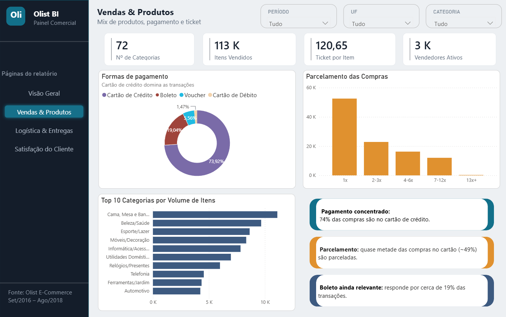
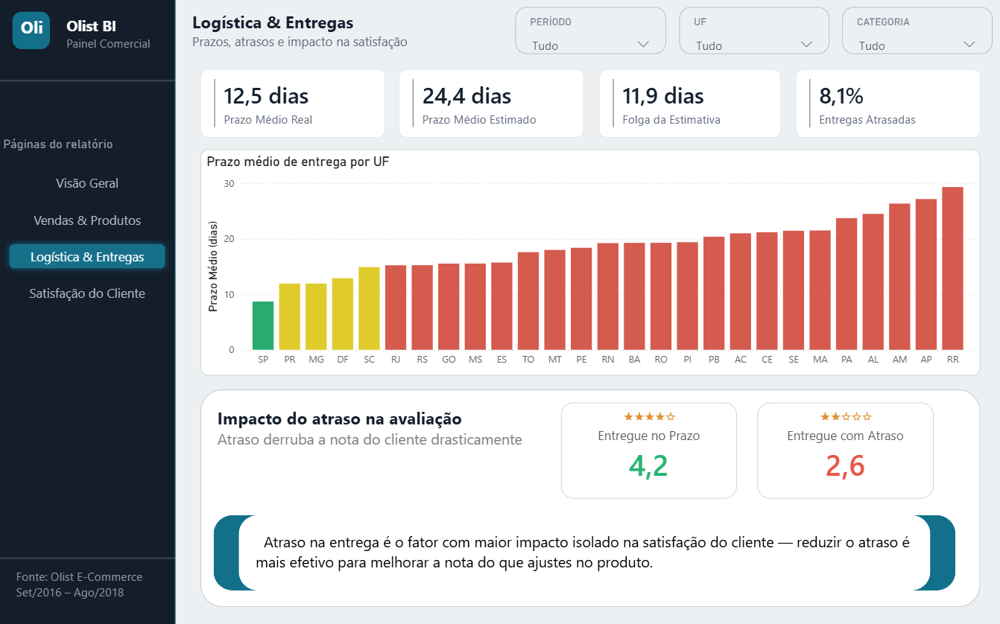
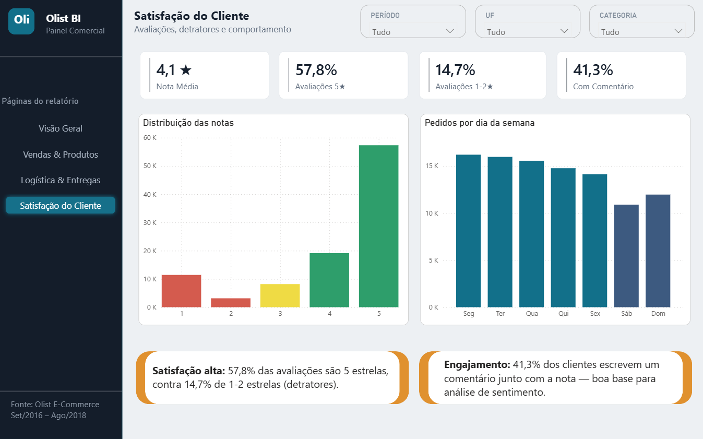

# 📊 Dashboard Comercial — Olist E-commerce (Power BI)

## Objetivo

Dashboard para acompanhamento do desempenho comercial de um marketplace de 
e-commerce (Olist), com análise de receita, vendas por categoria, prazos 
logísticos e satisfação do cliente, permitindo identificar padrões de 
concentração geográfica, sazonalidade e fatores que impactam a avaliação 
do consumidor.

## Ferramentas

- Power BI
- DAX
- Power Query

## Estrutura do Dashboard

### 1️⃣ Visão Geral
- **KPIs principais:** Receita (GMV), Pedidos, Ticket Médio, Nota Média e 
  Entregas no Prazo
- **Receita e Pedidos por mês:** evolução histórica com identificação de picos
- **Top 10 Receita por UF:** concentração geográfica das vendas
- **Top 10 Categorias por Receita:** ranking das categorias mais rentáveis

### 2️⃣ Vendas & Produtos
- **KPIs principais:** Número de Categorias, Itens Vendidos, Ticket por 
  Item e Vendedores Ativos
- **Formas de pagamento:** distribuição entre cartão de crédito, boleto, 
  voucher e cartão de débito
- **Parcelamento das compras:** número de parcelas mais utilizado
- **Top 10 Categorias por Volume de Itens**

### 3️⃣ Logística & Entregas
- **KPIs principais:** Prazo Médio Real, Prazo Médio Estimado, Folga da 
  Estimativa e Entregas Atrasadas
- **Prazo médio de entrega por UF:** comparação entre estados
- **Impacto do atraso na avaliação:** nota média de pedidos entregues no 
  prazo vs. com atraso

### 4️⃣ Satisfação do Cliente
- **KPIs principais:** Nota Média, Avaliações 5★, Avaliações 1-2★ e 
  Pedidos com Comentário
- **Distribuição das notas:** volume de avaliações por nota
- **Pedidos por dia da semana**

## Principais análises

- Receita, pedidos e ticket médio consolidados
- Concentração geográfica de vendas (SP, RJ e MG somam a maior parte da receita)
- Sazonalidade de vendas (pico em novembro — Black Friday)
- Mix de categorias e formas de pagamento
- Relação entre prazo de entrega e nota de satisfação
- Distribuição de avaliações e taxa de engajamento em comentários

## Fonte de dados

Dataset público **"Brazilian E-Commerce Public Dataset by Olist"**, 
disponível no Kaggle: 
[kaggle.com/datasets/olistbr/brazilian-ecommerce](https://www.kaggle.com/datasets/olistbr/brazilian-ecommerce)

Período dos dados: Setembro/2016 a Agosto/2018

## 🔗 Dashboard interativo
[Acessar dashboard](https://app.powerbi.com/view?r=eyJrIjoiNGI4OWIyOTUtY2VhZC00ZTIxLTk4ZTUtMjdjZDBmZjAzZmJiIiwidCI6IjcyODMwODAzLTI3MmMtNDMwOC1hYTFhLTY3ZWRmNmQ5OWUyMiJ9&pageName=80b07376602ea7ab78a8)

## Preview

**Visão Geral**

**Vendas & Produtos**

**Logística & Entregas**

**Satisfação do Cliente**

## Estrutura do repositório

├── dashboard.pbix
├── imagens/
│   ├── visao-geral.png
│   ├── vendas-produtos.png
│   ├── logistica-entregas.png
│   └── satisfacao-cliente.png
└── README.md

## Contato
[LinkedIn](https://www.linkedin.com/in/fernanda-terra-3650a3265)
